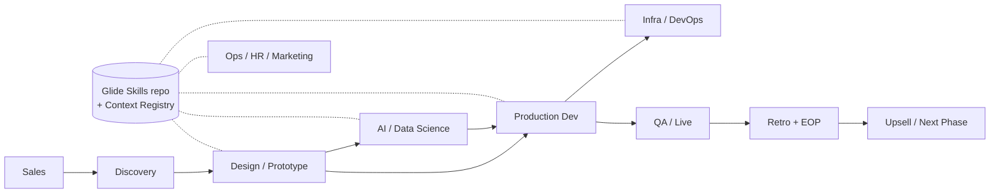

# Toboggan Workflow Discovery — Cross-Interview Synthesis

**Source:** 15 completed analyses in the [Toboggan – Workflow Metrics Interview Tracker](https://www.notion.so/3580119c366180aabb70c6ad4f944137). **Period covered:** May 1 – May 21, 2026. **Unique people interviewed:** 14 (plus a 4-person group retro counted once). **Projects referenced:** 13 mandates + internal ops.

---

## 1. Interview inventory

|#|Interview|Date|Project(s)|Primary lens|
|---|---|---|---|---|
|1|Guy|May 11|Unlocked Labs, Proof|Brownfield vs. greenfield|
|2|LP|May 7|Convoy, BIG Health|Glide-native vs. locked-down|
|3|Claire × Ian × Cadel × RJ — Birches retro|May 6|Birches|Design-dev retro (group)|
|4|Guy — Design × Data Dev Part 1 (Guild)|May 1|Proof, Convoy, Seen Health|Context Registry pitch|
|5|Dmitry|May 19|Elion|Storybook synchronization|
|6|Elodie|May 12|Gates|FE dev consuming AI prototype|
|7|Adrienne — Design Workflows|May 5|CUISS, Gates|Designer running two-phase AI prototype|
|8|Shelley — Marketing|May 5|Toboggan Website|Blog + LinkedIn pipeline|
|9|Chris|May 6|Birches|Handoff taxonomy from PL angle|
|10|Arthur|May 13|Elion (AI side)|Eval loop + skill ROI|
|11|Rob|May 14|JScreen|Agent-built infra + boundary calls|
|12|Adrienne — CUISS & Gates (Design Guild)|May 12|CUISS, Gates|Meta-prompting + Obsidian|
|13|Adel|May 20|Gates, mRelief, Axyles|SME alignment + AI handoff|
|14|Shelley — HR Ops|May 21|Internal HR / Ops|Daily task + policy AI|
|15|Claire — Birches AI handoff (Design Guild)|May 19|Birches|Token guardrails + prototype portal|

---

## 2. Roles represented

Counting unique individuals (people, not interview slots). Several wear more than one hat.

|Role|Count|People|
|---|---|---|
|Developer|9|Guy, LP, Ian, Cadel, Dmitry, Elodie, Chris, Rob, (+ Etienne / Fahad / Edward as referenced colleagues)|
|Designer|3|Claire, Adrienne, (+ Edward referenced)|
|Project Lead|4|Guy, LP, Chris, Arthur (Cecile referenced)|
|AI Engineer / Data Scientist|3|Guy, Arthur, Adel|
|Operations|1|Shelley (covered both marketing and HR ops in 2 sessions)|

**Observation:** Devs are the largest group, but designer voices punch above their weight — Claire and Adrienne show up across 5 of the 15 sessions and are the most-quoted source of new workflow patterns.

---

## 3. Projects covered and how often they came up

|Project|Mentions|Notable in|
|---|---|---|
|Birches|4 interviews|Birches retro, Chris, Claire Guild, Cadel mentions|
|Gates|4 interviews|Adrienne ×2, Elodie, Adel|
|Elion|3 interviews|Dmitry, Arthur, (referenced by others)|
|Proof|2 interviews|Guy, Guy Pt1|
|Convoy|2 interviews|LP, Guy Pt1|
|BIG Health|1|LP|
|JScreen|1|Rob|
|Unlocked Labs|1|Guy|
|Seen Health|1 (referenced)|Guy Pt1, Chris|
|mRelief|1|Adel|
|Axyles|1|Adel|
|CUISS|1|Adrienne|
|Toboggan Website|1|Shelley|
|Internal HR/Ops|1|Shelley|

---

## 4. The seven handoffs that keep showing up

Chris explicitly enumerated the interdisciplinary handoff taxonomy; the rest of the interviews populate it with evidence.

|Handoff|Evidence (interview count)|Representative example|
|---|---|---|
|Design → Dev|**9** (Birches retro, Guy, Guy Pt1, Dmitry, Elodie, Adrienne ×2, Chris, Rob, Claire)|Birches: Cadel pointed AI at both prototype repo + prod repo; Ian rebuilt from screenshots|
|AI/Data Science → Dev|**6** (Guy Pt1, Elodie, Arthur, Adel, Chris, LP)|Gates: Adel hands API to Elodie after notebook calibration on 135 criteria|
|Dev → Infra/DevOps|**3** (Rob, Chris, Guy)|JScreen: Rob writes GCP Terraform almost entirely with Claude|
|AI Skill → Teammate (cross-discipline)|**5** (LP, Arthur, Shelley HR, Adrienne Guild, Elodie)|LP's weekly-report skill composes PDF + Linear + Fathom sub-skills|
|Design → AI/Data|**2** (Adel, Adrienne)|Gates: Adel found out about AI-generated feedback feature from UI prototype after the fact|
|Sales → Implementation|**1 explicit** (Chris) + implicit (LP Convoy)|LP: founder-supplied ChatGPT financials treated as raw input, not spec|
|Project → EOP / Retro / Upsell|**1 explicit** (Chris)|Chris flags EOP checklist as unfunded, post-billing-cycle workload|

---

## 5. Workflows mapped (cross-interview taxonomy)

Five workflow archetypes recur. Each is captured by at least two interview analyses.

### A. Greenfield prototype-first (≥4 interviews)

**Pattern:** Designer builds in Cursor + Vercel; dev adds APIs on demand; same repo, no environment split. **Cited in:** Guy (Proof), Adrienne (Gates Phase 1/2), Claire (Birches), Elodie (Gates consuming side). **Definition of done:** Vercel link + repo + spec doc that a dev team can build production against.

### B. Brownfield "designer in production code" (≥3 interviews)

**Pattern:** Engineer authors `CLAUDE.md` / setup skill; designer onboards into the client's working branch; PR-back-into-client cycle. **Cited in:** Guy (Unlocked Labs), Rob (JScreen contrast — _didn't_ try it), Claire (Unlock Labs follow-up applying Birches learnings). **Definition of done:** Designer's PR merges into the client's branch with no separate translation step.

### C. AI experimentation loop (notebook → API) (≥3 interviews)

**Pattern:** AI engineer iterates in notebooks across three axes — calibration / prompt / architecture — then ships a stable API contract early so the FE dev isn't blocked. **Cited in:** Adel (Gates, mRelief), Arthur (Elion eval loop), Elodie (consumer of Adel's PRs). **Definition of done:** API matches SME-aligned rubric; eval metrics defensible.

### D. Skill-based reporting / ops automation (≥4 interviews)

**Pattern:** Composable skill reads from one or more sources (Notion, Linear, Slack, Gmail, calendar, Fathom) and emits a draft artifact + Slack ping. **Cited in:** LP (weekly report), Arthur (Elion weekly updates), Shelley (daily to-do, candidate summaries), Adrienne (Obsidian + Claude weekly report button). **Definition of done:** Draft is good enough that the human only edits, doesn't author.

### E. Locked-down / restricted environment workflow (≥2 interviews)

**Pattern:** Client policy severs Toboggan's skill graph at the boundary; every interconnection that's automated internally becomes manual copy-paste. **Cited in:** LP (BIG Health — most extreme case), Adel (mRelief — no observability handoff possible). **Definition of done:** Deliverable lands in the client environment; SRED-relevant context preserved on the Toboggan side.

---

## 6. Pain points — ranked by interview frequency

|#|Pain point|Mentions|Most-cited evidence|
|---|---|---|---|
|1|**Source-of-truth drift between artifacts** (Figma / prototype / Storybook / prod)|7|Dmitry: "biggest challenge is synchronization between design and code"|
|2|**No shared component library or token enforcement**|5|Birches retro: same UI elements rebuilt 2–3× across dev streams; Cadel calls token registry "the one thing in 8 years that finally has a path"|
|3|**Reality gap between AI-mocked feature and production feasibility**|5|Adrienne Gates: PDF highlighting trivial to mock, "difficult to implement in production"; Elodie spent extra cycles debugging it|
|4|**Setup / onboarding friction** (env, dependencies, repo access)|5|Guy: "two 1-hour meetings" to set up Claire on Unlock Labs before he wrote the CLAUDE.md|
|5|**Skill governance: discoverability, evals, contribution back**|4|LP: "how do shared skills get better when everyone modifies their own copy?"; Chris: "discovery and utilization process is awkward"|
|6|**SME alignment / requirements ambiguity**|4|Adel Gates: 135 criteria, conflicting SME scores create calibration uncertainty; Adrienne: vocabulary fragmented across source docs|
|7|**Manual copy-paste between systems**|3|LP BIG Health: "every artifact crossing the boundary is a manual copy/paste"; Shelley: blog publishing waits on Sarah + LP serially|
|8|**Late designer access to staging / production / QA**|3|Birches retro: unstable staging forced PostHog as proxy QA; Elodie: no automated e2e tests|
|9|**AI tools "take liberties" — over-spec, drift, hallucinate context**|3|Chris (JScreen AI scoping tool); Rob ("agents reinforce what they already see"); Arthur ("metric hacking")|
|10|**Glossary / vocabulary inconsistency leaks into prompts and code**|2|Adrienne (Gates: rubric / criteria / criterion); Adel (Gates: 135 criteria, SME synonyms)|
|11|**Context-switching cost between projects / clients / sessions**|2|Adrienne (paused mid-project); Shelley HR ("biggest cognitive load")|
|12|**Knowledge fragmentation across tools** (Notion / Drive / BambooHR / Slack)|2|Shelley HR: "manageable for me, barrier for a successor"; LP at BIG Health|
|13|**Vibe-coded client inputs treated as spec, not observation**|1|LP Convoy: founder's ChatGPT financials, "he tells us essentially what ChatGPT wants us to do"|
|14|**Repo location drift** (designer's personal GitHub vs. Toboggan org)|2|Adrienne (Gates) and Elodie both flagged the in-flight migration on Gates|
|15|**EOP checklist is unfunded, post-billing-cycle work**|1|Chris|
|16|**No agreed-upon QA practice / observability is "where testing was 15 years ago"**|2|Rob; Elodie|

---

## 7. Opportunities — ranked by frequency

|#|Opportunity|Mentions|Strongest pitch|
|---|---|---|---|
|1|**Context Registry as project artifact** (`AGENTS.md`, `DESIGN.md`, `DATA.MD`)|7|Guy Pt1 Guild Sync introduced the idea; Birches retro, Adrienne, Claire, Dmitry, LP, Rob all converge on a version of it|
|2|**Setup skill / scaffolding skill** (`CLAUDE.md` bootstrap, env in 3 commands)|5|Guy: CLAUDE.md proof-of-concept on Unlock Labs; Rob proposes generic "infra-setup skill" for cloud functions; Claire applying to Unlock Labs|
|3|**Shared design-token / component registry** (per-project, vibe-coded prototypes use real Tailwind)|5|Birches retro: Cadel — "finally feasible"; Claire's `refactor to design tokens` Cursor skill on Birches|
|4|**Prototype repo as first-class handoff artifact, on Toboggan GitHub org by default**|4|Adrienne self-corrected mid-Gates; Elodie's PDF highlighting fix only worked because Adrienne migrated; standardize at kickoff|
|5|**Telemetry / observability for skill invocation + workflows**|4|LP: OTel from Claude Code / Codex / OpenCode → PostHog via Glide Bootstrap, "few hours of work"; Chris ("measure usage, not ROI"); Rob (skill-use observability)|
|6|**Eval contracts / output-shape assertions for shared skills**|3|LP: real blocker on cross-contribution; Arthur: eval loop with HITL; Adel: SME annotation review as eval|
|7|**Meta-prompting workflow encoded as a skill** (ChatGPT-intent-partner → Cursor-execute → ChatGPT-spec)|2|Adrienne Guild explicitly building this; Claire applying related "design-aligns-with-dev" pattern|
|8|**Feasibility-spike trigger / decision rule** ("AI difficulty signals dev difficulty")|2|Adrienne Guild: PDF highlighting was the canonical miss; Birches retro: Ian's flagging was ad hoc and person-shaped|
|9|**Vercel preview as visual version control** (branch naming = readiness stage)|3|Claire Birches: `S30-feature` / `S60-feature` + Prototype Portal; Guy / Adrienne use preview URLs as the demo surface|
|10|**Storybook-MCP for component lookup by AI agents**|2|Dmitry Elion (already using Storybook locally); Claire Birches (frontend V2 source folder serves similar role)|
|11|**Living design journal / decision log skill**|2|Adrienne Guild: "documentation is our biggest struggle" — top agent target; Claire: Obsidian as raw scratchpad|
|12|**Glossary bootstrap as Phase 0 step** for niche domains|2|Adrienne (Gates); Adel (Gates) — independently arrived at it|
|13|**Human-in-the-loop approval gates for expensive / irreversible AI actions**|3|Arthur Elion eval loop; Adel HITL review on mRelief; Shelley HR explicit preference|
|14|**Bi-weekly cross-disciplinary AI workflow forum / Guild**|2|LP + Antoine both want it; Guy Pt1 + Antoine the same week — blocked on Sarah|
|15|**Bridge pattern for locked-down environments** (named convention, sanctioned copy-paste)|1|LP: "BIG Health won't be the last PHI mandate"|
|16|**Model cost benchmarking per skill** (GLM 5.1 vs. Claude, etc.)|1|LP: timesheet skill, equivalent output at >10× cheaper|
|17|**API spec as first-class artifact on greenfield**|2|Rob (JScreen retrospective regret); Guy Pt1 (Convoy migration)|
|18|**Cost-estimate guardrails before `terraform apply` / expensive jobs**|1|Rob: "you could burn 10 grand"|
|19|**Standardize "implementation reality flag" as a named ritual**|1|Birches retro: Ian's practice is currently person-shaped, not process-shaped|

---

## 8. Notable tensions and contradictions surfaced

These are unresolved across interviews — useful to flag rather than paper over.

- **Constraint vs. autonomy on tooling.** Guy jokes about being a "dictator" on Cursor + Claude; Antoine flags the cost of stifling people in a fast-moving space. Real tradeoff, no decision rule yet.
- **Designer-led front-end: greenfield blessing or brownfield blessing?** Adrienne / Claire say greenfield enables it; Rob explicitly argues the opposite — that brownfield is where AI-augmented designers actually shine because the rails are already laid.
- **AI prototype as code (Cadel) vs. AI prototype as visual reference (Ian).** Same Birches project, same handoff bundle, two opposite consumption patterns. Both succeeded; neither was named as the official path.
- **Storybook adoption: early discipline or late maturity?** Dmitry says don't introduce too early (gets abandoned); Birches retro shows the cost of introducing too late (rebuilt by hand). No team-wide rule.
- **Architecture suggestions from AI: trust or escalate?** Elodie hits this with Chris's pushback on a ChatGPT suggestion. No routing rule for when AI architecture proposals get senior review _before_ PR.
- **Vibe-coded client inputs: garbage or signal?** LP / RJ converge on "observation, not specification" — but no decision rule for when to stop translating and start refusing.
- **Skill ownership: personal or shared?** LP wants composability + cross-contribution. Adel wants manual control of his codebase and avoids Claude Code. Elodie abandoned the Claude PR review skill as too exhaustive. The team has not landed on what "shared" means in practice.
- **Speed vs. craft.** Rob is most direct: vibe-coded throwaways are fine for internal tooling, dangerous for HIPAA production. The "is this risk intentional?" question is the one most often unasked.

---

## 9. Cross-cutting recommendations

Synthesized from the patterns above — these recommendations are supported by 3+ interviews each.

### Tier 1 — High-evidence, lowest-cost

1. **Land the Context Registry pattern as a kickoff artifact.** `AGENTS.md` / `DESIGN.md` / `DATA.MD` proposed by 7 interviews. The proposal already exists (Guy Pt1, May 1); the next 6 interviews validate it independently.
2. **Setup skill per project, run from a fresh-machine container in CI.** 5 interviews. Guy's `CLAUDE.md` on Unlock Labs is the proof; Rob's "infra-setup skill" generalizes; Claire is already replicating on Unlock Labs.
3. **Wire OpenTelemetry → PostHog via Glide Bootstrap.** LP estimates a few hours of work. Closes Chris's "measure usage, not ROI" gap and Rob's "is my installed skill actually being invoked?" question simultaneously.
4. **Default all prototype repos to the Toboggan Labs GitHub org at kickoff.** 4 interviews. Adrienne already shifting; one line on a Phase 0 checklist eliminates the in-flight migration class of blocker.
5. **Token / design-system registry as Sprint 0 on greenfield.** 5 interviews. Vibe-coded prototypes already use real Tailwind, so this is a setup choice, not a perpetual divergence problem. Claire's `refactor to design tokens` Cursor skill on Birches is the working pattern.

### Tier 2 — Clear pattern, needs scoping

6. **Define a "feasibility spike candidate" flag during design.** Adrienne: AI difficulty is a signal of dev difficulty. Should trigger a half-day dev spike before client demo lock-in. Catches the PDF-highlighting class of late surprise.
7. **Output-shape eval contract per shared skill** (LP, Arthur, Adel). Unblocks cross-contribution without inventing CI heavyweight.
8. **Living-design-journal skill** (Adrienne, Claire). Weekly Obsidian/Cursor/ChatGPT/meeting-notes → `design-decisions.md` PR. Addresses the most-named documentation gap.
9. **Glossary bootstrap as Phase 0** for niche-domain projects (Adrienne, Adel). One SME working session before prompting starts.

### Tier 3 — Strategic / longer horizon

10. **Bridge-pattern playbook for locked-down environments.** LP: BIG Health won't be the last PHI mandate; document what gets reconstructed manually so the next PL inherits the playbook.
11. **Model benchmarking per skill** (LP). Three-skill A/B (weekly report, timesheet, one mid-complexity) on GLM 5.1 vs. Claude.
12. **Run the cross-disciplinary AI workflow forum on a 30-day trial** (LP + Antoine + Guy Pt1). All three want it. Stop waiting.
13. Ways of Working for the Work around the Work 
	1. Context Infrastructure - across company + per project
	2. Framework we can default to that is flexible for people to override as needed
	3. Every mandate is a way to dogfood tools and experiment new ways of working
	4. Leverage retrospectives more for these handoffs
	5. Metric for success: Speed to alignment Client <-> Design <-> Dev <-> Data <-> Customer/End user
	6. Quarterly review 
		1. Focus was design x data x dev > ops/sales/marketing 
		2. May revisit more of this in future
	7. Internal Culture - Cultivate Curiosity vs. Top Down Mandate 

---

## 10. Coverage gaps worth filling

Topics that surfaced but lack interview depth:

- **Sales → Discovery handoff.** Only Chris named it; nobody from sales side interviewed yet.
- **Client-side EOP / retro / upsell.** Chris flagged EOP as unfunded; no follow-up from finance / project-management angle.
- **QA discipline.** Elodie noted "no team-wide convention." No QA-role interview to compare.
- **Designer-to-designer handoff.** Adrienne flagged it (Gates Phase 1 → Phase 2 — she was both, but if she weren't, no template). No second-designer interview to triangulate.
- **Client-side AI literacy.** LP (Convoy) is the only data point; pattern likely repeats and is worth its own session.
- **Brownfield + designer-in-prod-code outcome.** Guy's Unlock Labs experiment was mid-flight at interview time; follow up on Claire's first PR result.

---

_Synthesis assembled from the 15 "Done" analyses in the tracker as of 2026-05-22. Each pain point and opportunity above links back to specific interview evidence; this document is the index, not the source._
